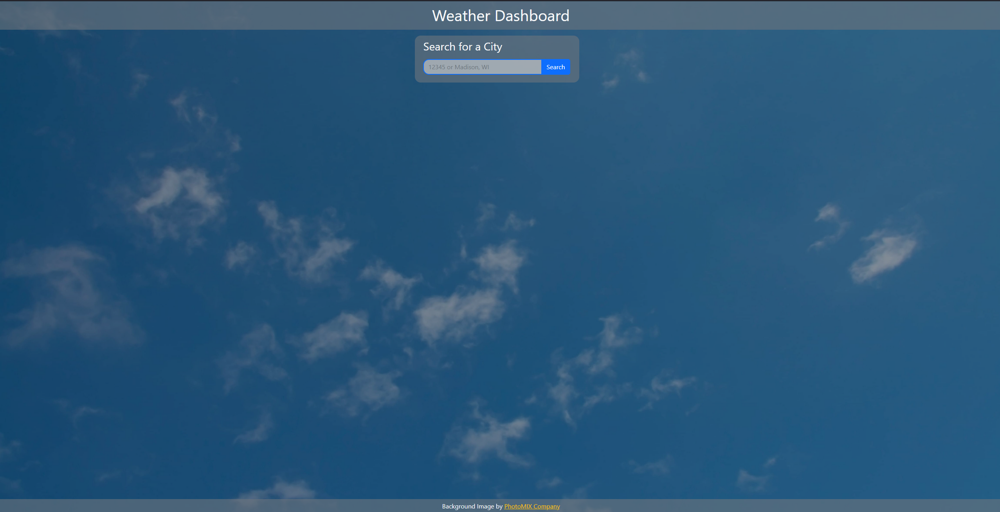

# Simple Weather Dashboard

## Description

A simple website that displays weather for any city within the U.S. Both the current weather and forecast are provided with each search. The latest 10 searches are added to the search history on the right side of the page. Clicking on a previous search will reload the weather for that city. If you search for more than 10 cities, the oldest will be removed and deleted. All of the weather and geocoding data is fetched from the Open Weather API free resources.

This site does not provide functionality for any location outside of the U.S.

User Story:

```
AS A traveler
I WANT to see the weather outlook for multiple cities
SO THAT I can plan a trip accordingly
```

Acceptance Criteria:

```
GIVEN a weather dashboard with form inputs
WHEN I search for a city
THEN I am presented with current and future conditions for that city and that city is added to the search history
WHEN I view current weather conditions for that city
THEN I am presented with the city name, the date, an icon representation of weather conditions, the temperature, the humidity, and the the wind speed
WHEN I view future weather conditions for that city
THEN I am presented with a 5-day forecast that displays the date, an icon representation of weather conditions, the temperature, the wind speed, and the humidity
WHEN I click on a city in the search history
THEN I am again presented with current and future conditions for that city
```

## Table of Contents

- [Simple Weather Dashboard](#simple-weather-dashboard)
  - [Description](#description)
  - [Table of Contents](#table-of-contents)
  - [Installation](#installation)
  - [Usage](#usage)
  - [License](#license)
  - [How to Contribute](#how-to-contribute)
  - [Tests](#tests)
  - [Questions](#questions)

## Installation

There is nothing to install with this project. To see the final product, please visit this webpage: [https://pbp66.github.io/simple-weather-dashboard/](https://pbp66.github.io/simple-weather-dashboard/)

## Usage

Upon visiting the website, you will see a mostly blank screen with a search box in the center. To see the weather for a city, specify a zip code or search for a city with the format `city, ST` like `Madison, WI`.


Searching Madison, WI in the winter may result in a weather page looking like this:


Your search history will appear on the right hand side of the screen. The large block of content is the current weather, providing several key pieces of information. Underneath will be the forecast for the next 120 hours.

All information is sourced from the Open Weather API.

## License


MIT

Copyright (c) 2022 James Perry

Permission is hereby granted, free of charge, to any person obtaining a copy of this software and associated documentation files (the "Software"), to deal in the Software without restriction, including without limitation the rights to use, copy, modify, merge, publish, distribute, sublicense, and/or sell copies of the Software, and to permit persons to whom the Software is furnished to do so, subject to the following conditions:

The above copyright notice and this permission notice shall be included in all copies or substantial portions of the Software.

THE SOFTWARE IS PROVIDED "AS IS", WITHOUT WARRANTY OF ANY KIND, EXPRESS OR IMPLIED, INCLUDING BUT NOT LIMITED TO THE WARRANTIES OF MERCHANTABILITY, FITNESS FOR A PARTICULAR PURPOSE AND NONINFRINGEMENT. IN NO EVENT SHALL THE AUTHORS OR COPYRIGHT HOLDERS BE LIABLE FOR ANY CLAIM, DAMAGES OR OTHER LIABILITY, WHETHER IN AN ACTION OF CONTRACT, TORT OR OTHERWISE, ARISING FROM, OUT OF OR IN CONNECTION WITH THE SOFTWARE OR THE USE OR OTHER DEALINGS IN THE SOFTWARE.

## How to Contribute

Before contributing, be sure to read the GitHub Code of Conduct. If you have an issue, search all open issues to see if one matches the description of your issue. If not, proceed to create one providing details on the issue, errors, OS, options provided, installed node packages, etc. Issues are not assigned to anyone by the repository team. To select an issue to work on, open a pull request and generate a new branch labeled as the issue. Add your name as a contributor to the issue in question. When you make the desired changes and fixes, push all changes to your branch on the repository and submit. The repository team will review the changes. If acceptable, we will merge the changes to main and we will notify you of a successful merge or any necessary changes before a merge can take place.

## Tests

No Tests Provided

## Questions

Repo owner: [pbp66](https://github.com/pbp66).
For any questions, you may contact pbp66 via email: pbp66.coding@gmail.com. Please format your email using the following template:

-   Subject: Repository - Question/Issue
-   Body: Summarize the issue with a brief description for the first paragraph. Additional paragraphs can be used for a long description, if needed. Include any errors when using this project
-   Signature: Please leave an email address so that any updates are sent get back to you.
